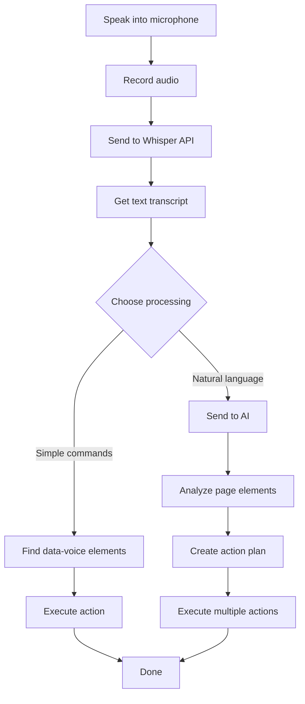

# Voice UI

Just playing around to see if an LLM can control DOM elements.

## What is DOM?

The DOM (Document Object Model) is kinda like LEGO for websites every button, image, text box, or menu is its own little block. The idea is to use an LLM to find and control those blocks for you using voice or text.

## How It Works



## Setup

1. Get API keys:
   - [OpenAI](https://platform.openai.com) for speech recognition
   - [Groq](https://console.groq.com) for AI commands

2. Create `.env.local`:
```bash
OPENAI_API_KEY=your_openai_key
GROQ_API_KEY=your_groq_key
```

3. Install and run:
```bash
pnpm install
pnpm dev
```

## Usage

**Simple commands:** Add `data-voice="play music"` to elements
```html
<button data-voice="play music">Play</button>
```

**Natural language:** Just speak normally
- "Send a message saying hello"
- "Play music and turn on notifications"
- "Select blue color"

The AI figures out which buttons to click and what to type.

## What's Inside

- **Speech to text:** OpenAI Whisper
- **AI Inference:** Groq LLaMA  
- **Web interface:** Next.js + Tailwind
- **Components:** shadcn/ui
